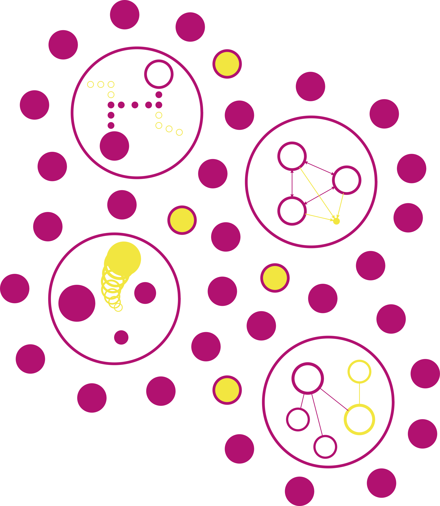

	<h2>
	
Workshop on Open Problems in Learning and Verification of Neural Networks

	</h2>
	

	

Held physically in Paris on July 17, 2023

<!-- 	
<h3>Consider bringing a poster for the poster session!</h3>
 -->

### Keynote

[Alessio Lomuscio](https://www.imperial.ac.uk/people/a.lomuscio){:target="_blank"} (Imperial College London, UK)

### Round-Table Hosts

[Nathanaël Fijalkow](http://games-automata-play.com/){:target="_blank"} (CNRS, LaBRI, France)
 
&emsp;*Synthesis*
 
[Nils Jansen](https://njansen123.github.io/){:target="_blank"} (Radboud University Nijmegen, The Netherlands)
 
&emsp;*Safe Reinforcement Learning*
 
[Bettina Könighofer](https://www.iaik.tugraz.at/person/bettina-koenighofer/){:target="_blank"} (TU Graz, Austria)
 
&emsp;*Shielding*
 
[Daniel Neider](https://rc-trust.ai/neider/){:target="_blank"} (TU Dortmund, Germany)
 
&emsp;*Neuro-symbolic Verification*

### Important Details

**Place:** Co-located with [CAV 2023](http://www.i-cav.org/2023/){:target="_blank"} in Paris, France
 
**Workshop date:** July 17, 2023
